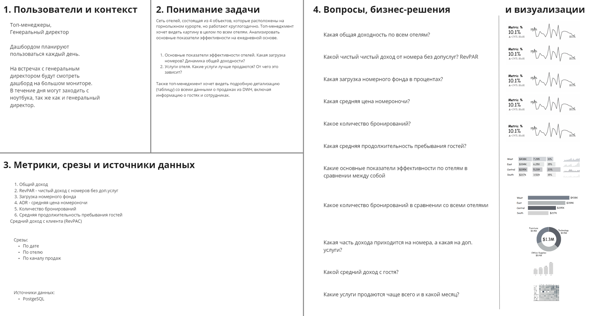
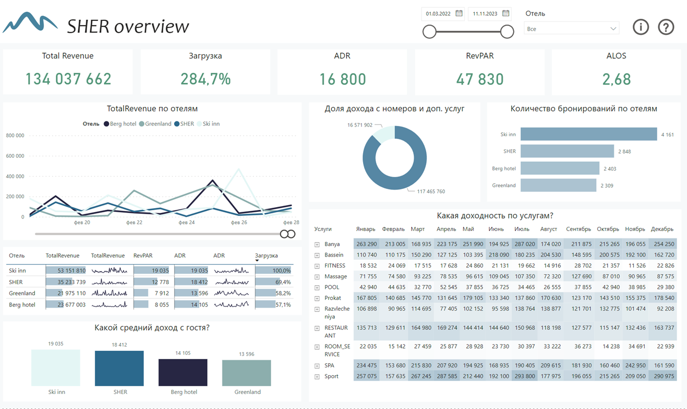

# Разработка дашборда для сети отелей "SHER"

Содержание:

1. Описание проекта
2. Сбор требований
3. Разработка архитектуры аналитического решения
4. Моделирование DWH
5. Генерация данных с помощью Python
6. Разработка макета
7. Разработка дашборда в Microsoft Power BI
8. Итоги проекта
______________________

# 1. Описание проекта:

«SHER» - это сеть отелей, расположенных на популярном горнолыжном курорте Шерегеш. Сеть представлена четырьмя уникальными отелями, каждый из которых предлагает своим гостям особую атмосферу и неповторимые впечатления. Отличительной чертой сети является качество обслуживания, комфорт и близкое расположение к горнолыжным трассам.

Главная задача проекта:

Разработать дашборд для сети отелей «SHER». Для возможности мониторинга данных о работе каждого отеля и его показателях эффективности.

Цели проекта:

•	Предоставление топ-менеджменту «SHER HOTELS» оперативной информации о работе каждого отеля и его показателях эффективности.
•	Определение наиболее прибыльных отелей и возможных областей сокращения расходов.
•	Оценка данных о бронированиях.
•	Изучение популярных услуг и наиболее востребованных категорий номеров в гостиницах.

В качестве инструментов были использованы:
Microsoft Power BI, MIRO, DBeaver и Python.

# 2. Сбор требований

Результат данного этапа был оформлен по фреймворку Романа Бунина Dashboard Canvas 2.0., который позволил структурировать полученную информацию после интервью с топ-менеджером сети отелей.

Фреймворк содержит в себе 4 блока:
- 1 - это описание пользователей и контекста использования дашборда.
- 2 - понимание задачи.
- 3 - это метрики, срезы, источники данных.
- 4 – это вопросы, бизнес-решения и планируемые визуализации.

# 3. Разработка архитектуры аналитического решения

На основании полученных требований была разработана архитектура аналитического решения, которая включает в себя слои источников данных, хранилища данных и аналитики:

- 1	- Source Layer - слой систем источников данных OLTP (Online Transactional Processing) - обработка транзакций; системы быстро работают на добавление данных в БД, но не рассчитаны на аналитические запросы, данные создаются бизнес-процессами, из первого слоя все данные поступают в хранилище данных;
- 2	- Storage Layer - хранение данных для аналитики (DWH); 
- 3	 - Business Layer - слой доступа к данным для бизнес-пользователей через инструмент Power BI или SQL.

# 4. Моделирование DWH

Разработана физическая модель данных по схеме «Звезда» (по Кимбаллу), которая включает в себя 1 таблицу фактов и 7 таблиц измерений:

- guests_dim
- rooms_dim
- hotels_dim
- booking_channel_dim
- services_dim
- booking_dim
- employees_dim

Подробное описание модели данных можно 
[посмотреть здесь](https://github.com/Jessjesss/Dashboard_for_hotels/blob/master/database_description.md):

# 4. Генерация данных с помощью Python:

 Для тестирования аналитического решения был разработан скрипт на Python для генерации тестовых данных, которые соответствуют реальной структуре данных.

[Посмотреть коды генерации](https://github.com/Jessjesss/Dashboard_for_hotels/tree/master/Python_codes)

# 5. Разработка макета дашборда:
Макет разрабатывался в программе MIRO с использованием готовых элементов визуализаций из фреймворка “Dashboard Canvas 2.0”

# 6. Разработка дашборда в Microsoft Power BI: 

Модель данных разработана в соответствии со схемой "Звезда".
Таблица фактов hotels sales_fact содержит информацию о продажах отелей, а таблицы измерений (такие как hotels_dim, booking_dim и т.д.) содержат дополнительные описательные атрибуты, связанные с этими продажами (информацию об отеле, детали бронирований и т.д). 

Для анализа и создания визуальных элементов были разработаны 9 мер с помощью DAX:

TotalRevenue = SUM('hotels sales_fact'[Sales])

ADR = DIVIDE(COUNT('hotels sales_fact'[hotels booking_dim.count_nights])*SUM('hotels sales_fact'[hotels rooms_dim.price]),COUNT('hotels sales_fact'[booking_id]))*

Доход с номеров = COUNT('hotels sales_fact'[hotels booking_dim.count_nights])*SUM('hotels sales_fact'[hotels rooms_dim.price])*

Загрузка = DIVIDE(COUNT('hotels sales_fact'[booking_id]),COUNT('hotels rooms_dim'[room_id]))*

RevPAR = 'Меры'[ADR]*'Меры'[Загрузка]

Количество бронирований = COUNT('hotels booking_dim'[booking_id])

Средняя продолжительность пребывания гостей = DIVIDE(SUM('hotels sales_fact'[count_nights]),'Меры'[Количество бронирований])

В результате мы разработали дашборд, в котором присутствует:

- Селектор по дате и по отелю.

- Предусмотрена кнопка детализации данных и руководство пользователя.

- Карточки с ключевыми показателями эффективности с условным форматированием цвета.

- График с общим доходом отелей, с возможностью сравнения показателя в динамике со всеми отелями сети.

- Таблица со спарклайнами по основным показателям эффективности

- Кольцевой график, который показывает долю дохода с номеров и доп. услуг

- Линейчатая диаграмма с группировкой, которая позволяет наглядно сравнить количество бронирований по всем отелям.

- Матрица по доходности услуг с условным форматированием, которое позволяет визуально выделить как наибольшие значения доходности, так и наименьшие по месяцам.

- Гистограмма с группировкой, которая отвечает на вопрос: Какой средний доход с гостя?

Таким образом, мы разработали функциональный дашборд, который автоматизирует отчетность и позволяет мониторить необходимые показатели эффективности, а также продажи номеров, бронирования с возможностью детализированного просмотра и анализа данных.

# 7. Итоги проекта
Разработанный нами дашборд предоставляет удобный инструмент для оперативного мониторинга и анализа ключевых показателей деятельности отелей. 

Это обеспечивает возможность принятия более обоснованных и эффективных управленческих решений.

Процесс сбора требований был тщательно проведен с участием ключевых заинтересованных сторон, что позволило точно определить необходимый функционал и параметры дашборда. 

Макет и структура дашборда были разработаны с учетом лучших практик в области визуализации данных. Основные метрики и графики представлены понятным и легко воспринимаемым образом, что обеспечивает пользователям быстрый доступ к важным данным.

Все данные для наполнения DWH сгенерированы с помощью python.

Таким образом, выполненный проект предоставляет инструмент, способствующий улучшению управления и повышению эффективности бизнес-процессов в сети отелей «SHER».
